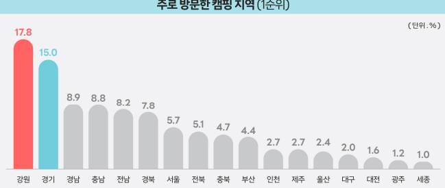
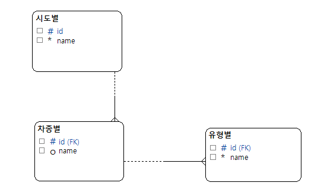
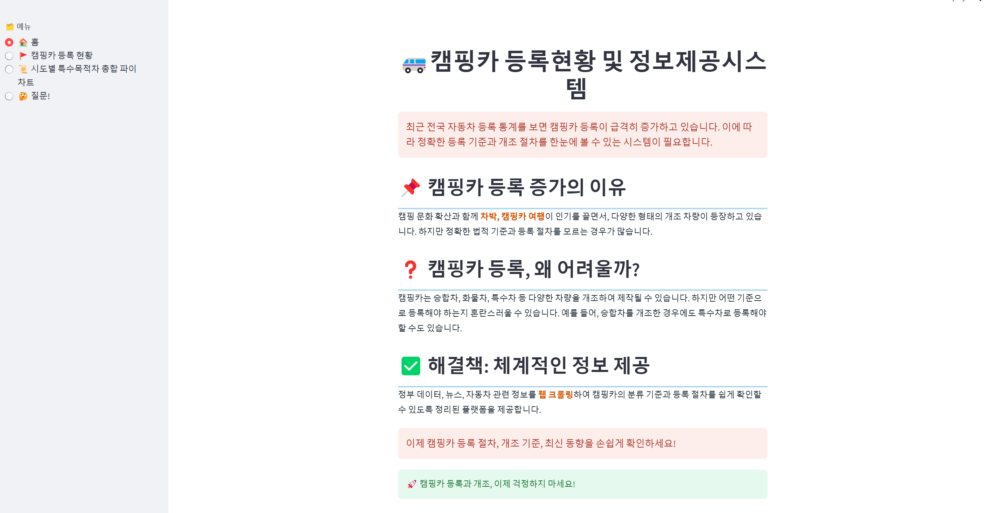
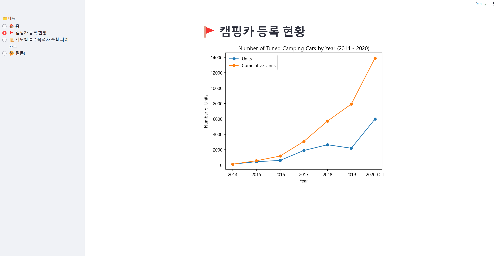
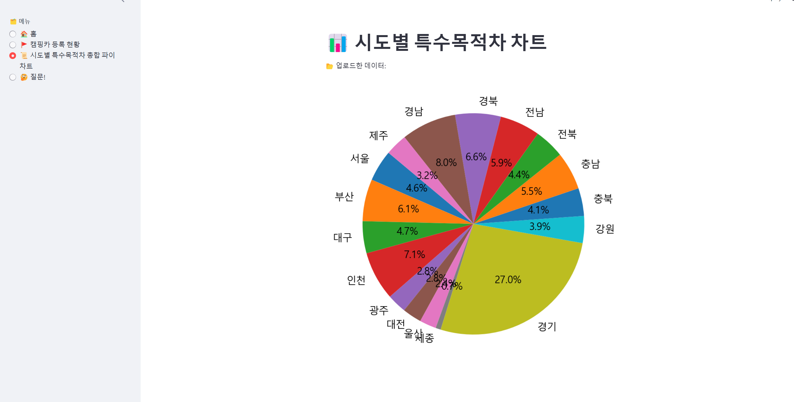
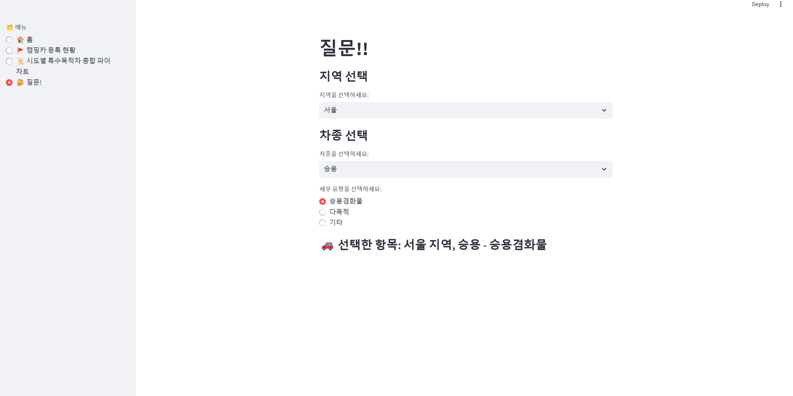
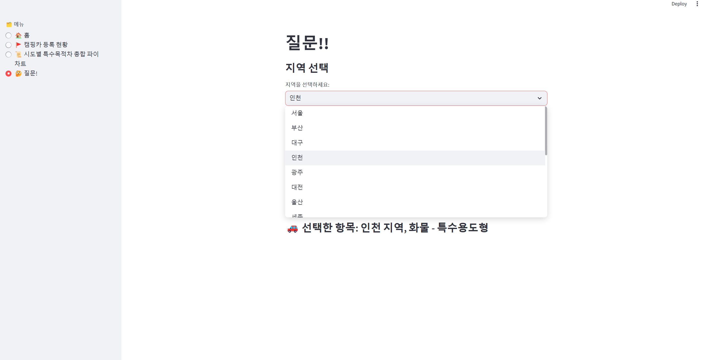

# 💚 We are SamSame!! 💚

## 🏕️ GitHub

  <table width="100%">
    <tbody>
      <tr>
        <td align="center" width="25%">
          <a href="https://github.com/kimseoungji0801">
             
            <strong>김성지</strong>
          </a>
        </td>
        <td align="center" width="25%">
          <a href="https://github.com/Nadaeji">
             
            <strong>나지윤</strong>
          </a>
        </td>
        <td align="center" width="25%">
          <a href="https://github.com/SOOSOO999">
             
            <strong>배정수</strong>
          </a>
        </td>
        <td align="center" width="25%">
          <a href="https://github.com/misong-hub">
             
            <strong>백미송</strong>
          </a>
        </td>
      </tr>
    </tbody>
  </table>

---
## 🏕️ 국내 캠핑카 현황
<table width="100%">
  <tr>
    <td align="center" valign="middle" width="50%">
       
      <small>캠핑이용자(2020~2022)</small>
    </td>
    <td align="center" valign="middle" width="50%">
      
    </td>
  </tr>
</table>

---
## 🏕️ 프로젝트 필요성 
### 1. 특수차량의 증가와 데이터 관리 부족
### 2. 산업 변화의 정보 비대칭 문제
### 3. 체계적인 정보 제공 시스템 필요 

---
## 🏕️ 기술 스택
<table width="100%">
  <tr>
    <td align="center" valign="middle" width="33%">
       
    </td>
    <td align="center" valign="middle" width="33%">
       
    </td>
    <td align="center" valign="middle" width="33%">
       
    </td>
  </tr>
</table>

---
## 🏕️ ERD

  <table>
    <tr>
      <td align="center" valign="middle">
         
        <small>ERD 테이블</small>
      </td>
    </tr>
  </table>

## 🏕️ Streamlit

  <table width="100%" cellspacing="0" cellpadding="0">
    <tr><td align="center">
       
      <small>홈 페이지</small>
    </td></tr>
    <tr><td align="center">
       
      <small>캠핑카 등록 현황 페이지</small>
    </td></tr>
    <tr><td align="center">
       
      <small>시도별 특수목적차 비율 페이지</small>
    </td></tr>
    <tr><td align="center">
       
      <small>질문 페이지</small>
    </td></tr>
    <tr><td align="center">
       
      <small>질문 페이지 - 지역 선택</small>
    </td></tr>
    <tr><td align="center">
       
      <small>질문 페이지 - 차종 선택</small>
    </td></tr>
    <tr><td align="center">
       
      <small>질문 페이지 - 선택항목 반영</small>
    </td></tr>
  </table>

---
## 🏕️ 한줄회고 

👨🏻‍💻 김성지
> "크롤링을 처음 배우면서 맞닥뜨린 어려움은,모르는 것을 알아가는 과정이 얼마나 소중한지를 깨닫게 해주었다.뜻대로 되지 않았던 오늘 덕분에, 내일 더 탄탄하게 성장할 수 있음을 느꼈다."

👩🏻‍💻 나지윤
> "데이터 수집·웹 크롤링·EDA·DB 설계를 일련의 프로젝트로 구현하며 학습을 실전에 체화했고, 완전 숙지 이전에 착수한 경험은 보완 과제를 선명히 하여 향후 심화 학습의 로드맵을 확립하는 계기가 되었다."

👩🏻‍💻 백미송
> "웹 크롤링과 Streamlit을 활용해 산업 데이터의 비대칭 문제를 시각화하며, 데이터 수집부터 서비스화까지 전 과정을 직접 경험했습니다."

👨🏻‍💻 이현민
> "많은 부족함을 느껴 아쉬움이 남는다."

